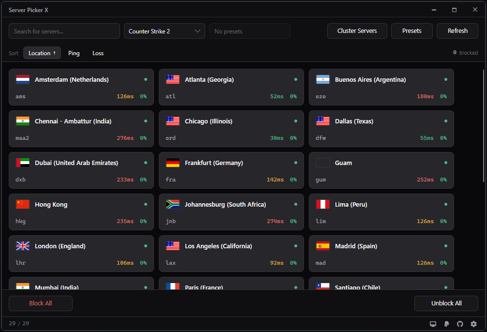

# Server Picker J

<div align="center">

  
  
  

</div>

<table>
<tr>
<td valign="middle">

**This is a fork of [server-picker-x](https://github.com/FN-FAL113/server-picker-x) by FN-FAL113.**

The app and nearly all of its code are his work. This version just 
reworks the user interface and adds a few quality of life features on top. 
I don't take donations for it, if it's useful to you in any way, please 
consider supporting the original author instead.

</td>
<td valign="middle" width="170" align="right">
<a href="https://www.paypal.com/paypalme/fnfal113">
  
</a>
</td>
</tr>
</table>

A lightweight server picker for Counter Strike and Deadlock with cross-platform support for **Windows** and **Linux**. Blocks game servers by location so the game matches you where you want.

## Download

**[Latest release](https://github.com/cankhut/server-picker-j/releases)**

## Screenshot



## What's different from the original

- Servers are displayed as cards instead of a table, click on it to block or allow it
- Light and dark themes, following your system setting by default
- Ping is the average of four probes, so a server that spikes doesn't read the same as a steady one
- Blocked servers keep their last ping, so they still sort correctly
- Right click a card to block every server at least as slow as it
- Presets can be shared as a short code and imported from your clipboard
- Optional auto refresh and optional close to system tray under settings tab
- Optionally applies your last used preset when the game launches, and unblocks everything again when it closes

## Install

**Windows:** extract anywhere, then run `ServerPickerX.exe` **as administrator**.

**Linux:** extract, then:

```
./RunServerPickerX.sh
```

The script adds the execute permission and launches the app with sudo on the
current shell. Don't run the binary directly with `sudo`.

## Updating

Download the latest release, open the zip, and copy the files inside it into your
existing Server Picker folder, overwriting when Windows asks. That's the whole update procedure.

Your `settings.json` isn't in the zip, so your blocked servers, presets, theme and
language all stay exactly as they were.

Close the app first, Windows won't let you overwrite files that are still running.

## Blocking persists after you close the app

Blocking a server creates a Windows Firewall rule (or an iptables rule on Linux). 
Those live in your operating system, not in the app itself, so they stay in place even 
after you close it, after a reboot and indefinitely until you remove them.

The app warns you on exit if servers are still blocked and offers to unblock
them. To clear everything at once, use **Remove App Rules** in Settings, it
removes only the rules this app created and leaves the rest of your firewall
alone.

If you delete the app while servers are still blocked, those rules stay behind.
Unblock first, or reinstall and use Remove App Rules.

## FAQ

**Will I get banned?**
The app does not modify any game or system files, I can assure you are safe from being banned when using the app as long as you do not download from untrusted sources. It will add necessary firewall policies to block game server relay ip addresses from being accessed by your network thus skipping them in-game when finding a match.

**Why does it need administrator or sudo?**
Creating firewall rules requires elevation on both Windows and Linux. Run it
normally and every operation fails.

**Windows SmartScreen says unrecognised publisher.**
The app isn't code signed, a certificate costs real money. You can build it
yourself from source if you'd rather not trust the binary.

**I'm receiving frequent timeouts when a match is being confirmed**
You may have blocked too many servers, for optimal searching and relaying block only the necessary server relays.

**Does the firewall reset remove every rule in my machine?**
No, it only removes this app's rules, this was an issue in an earlier build of 
the app but it should be completely fixed now.

## Troubleshooting

| Problem | Fix |
|---|---|
| Rules not applied, or the app won't start | Run as administrator on Windows, or use `./RunServerPickerX.sh` on Linux |
| No servers appear | Check your connection please, the server list comes from Steam's API |
| Every server shows no ping | Something else is blocking ICMP, or you're offline |

The app writes `server_picker_x_log.txt` and `settings.json` next to the
executable. Don't edit `settings.json` by hand, just use the Settings window please.

Found a bug? [Open an issue](https://github.com/cankhut/server-picker-j/issues)
with your OS, the steps to reproduce it, and the log file.

## Building from source

```
git clone https://github.com/cankhut/server-picker-j.git
cd server-picker-j
dotnet restore ServerPickerX.slnx
dotnet publish ServerPickerX/ServerPickerX.csproj -c Release -r win-x64
```

Use `linux-x64` for Linux. Output lands in
`ServerPickerX/bin/Release/net10.0/<runtime>/publish/`.

Run the tests with `dotnet test ServerPickerX.Tests.slnx`.

## Credit and licence

Based on [server-picker-x](https://github.com/FN-FAL113/server-picker-x) by
FN-FAL113, licensed **GPL-3.0**. This fork keeps that licence, and the full
commit history of the original project is preserved in this repository.

Parts of this fork were written with AI assistance. Everything in it has been
built, run and tested on multiple machines before release.

## Disclaimer

Not affiliated with, authorised by, or endorsed by Valve or its subsidiaries.
Trademarks belong to their respective owners.
